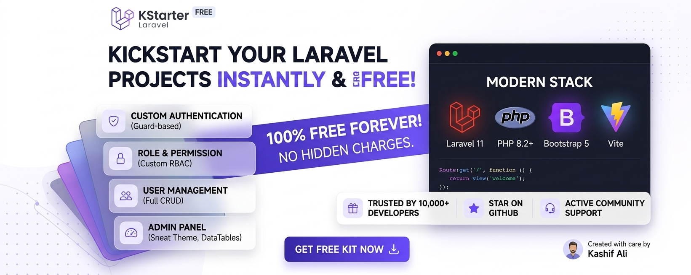
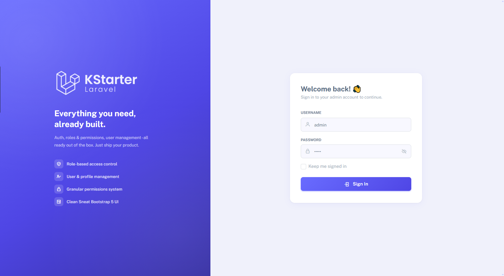
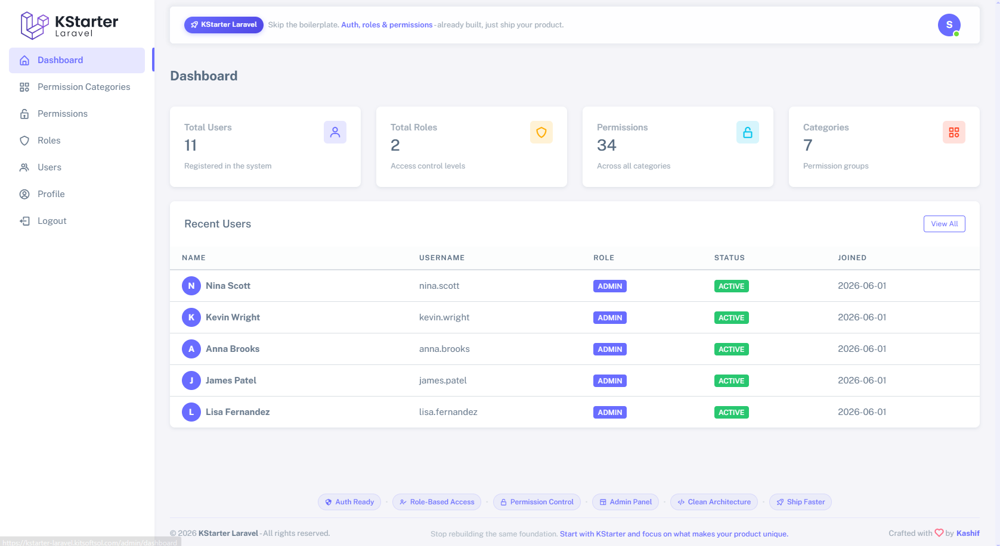
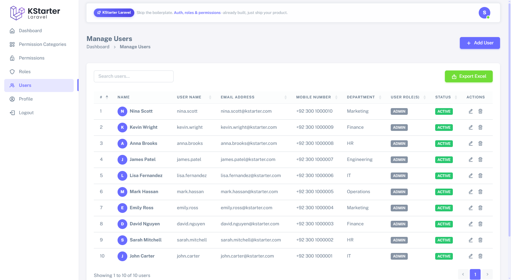
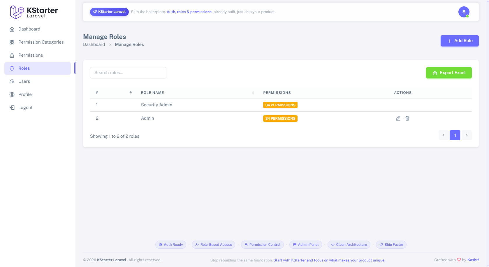
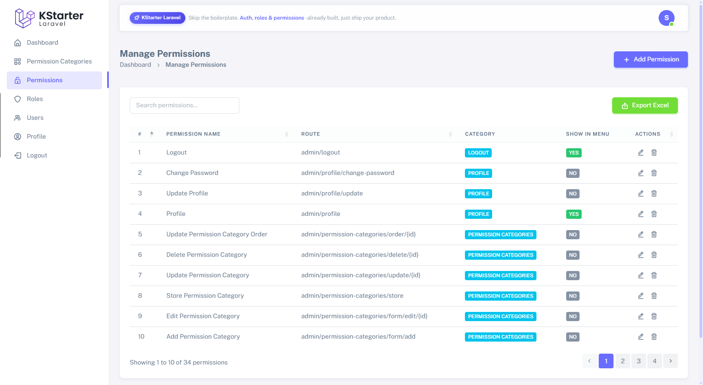
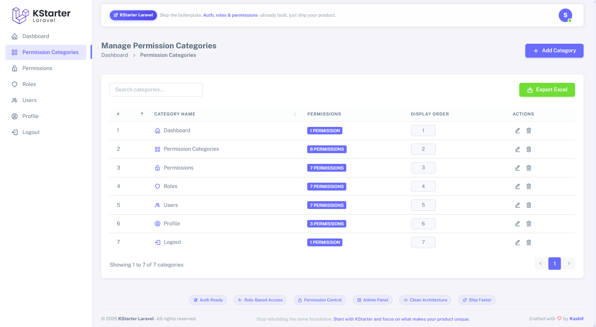
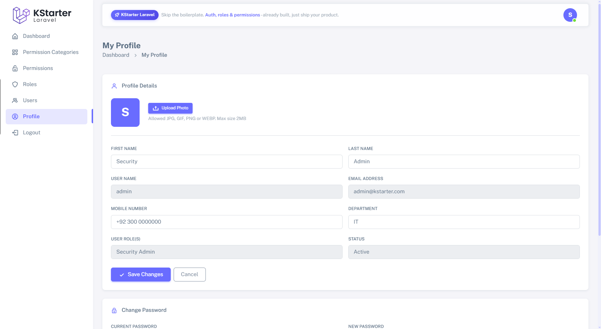

<p align="center">
  
</p>

<h1 align="center">KStarter Laravel</h1>

<p align="center">
  A modern, production-ready Laravel 11 admin starter kit with custom authentication,<br>
  role-based access control, user management, and a polished Sneat Bootstrap 5 admin panel.
</p>

<p align="center">
  
  
  
  
</p>

---

## Preview

<p align="center">
  
</p>

---

## Screenshots

### Login Page
<p align="center">
  
</p>

### Dashboard
<p align="center">
  
</p>

### Users Management
<p align="center">
  
</p>

### Roles Management
<p align="center">
  
</p>

### Permissions Management
<p align="center">
  
</p>

### Permission Categories
<p align="center">
  
</p>

### Profile Page
<p align="center">
  
</p>

---

## Features

| Feature | Description |
|---|---|
| **Custom Authentication** | Guard-based admin login with remember me, session management, and middleware protection — no Breeze or Jetstream |
| **Role & Permission (RBAC)** | Fully custom-built role-based access control with route-level permission checks, permission categories, and multiple roles per user |
| **User Management** | Complete CRUD with multiple role assignments, status toggling, profile management — all via AJAX offcanvas drawers |
| **Admin Panel** | Sneat Bootstrap 5 theme with DataTables, Excel export, Select2, SweetAlert2, and a responsive sidebar |
| **Clean Architecture** | Structured `Controller → Service → Library` pattern for separation of concerns and scalability |
| **Modern Stack** | Laravel 11, PHP 8.2+, Bootstrap 5, jQuery, Vite, and modern PHP best practices |

---

## Tech Stack

- **Backend:** Laravel 11, PHP 8.2+
- **Frontend:** Bootstrap 5 (Sneat theme), jQuery, Vite
- **Database:** MySQL / MariaDB
- **Libraries:** DataTables, Select2, SweetAlert2, Maatwebsite Excel
- **Auth:** Custom admin guard (no Breeze / Jetstream / Spatie)

---

## Requirements

- PHP >= 8.2
- Composer
- Node.js >= 18 & npm
- MySQL / MariaDB

---

## Installation

```bash
# 1. Clone the repository
git clone <repo-url> kstarter-laravel
cd kstarter-laravel

# 2. Install PHP dependencies
composer install

# 3. Install Node dependencies and build assets
npm install && npm run build

# 4. Copy environment file and generate app key
cp .env.example .env
php artisan key:generate

# 5. Configure your database in .env
DB_DATABASE=kstarter
DB_USERNAME=root
DB_PASSWORD=

# 6. Run migrations and seeders
php artisan migrate --seed

# 7. Serve the application
php artisan serve
```

Then visit `http://localhost:8000` for the landing page or `http://localhost:8000/admin/login` for the admin panel.

---

## Default Admin Credentials

| Field | Value |
|---|---|
| Username | `security_admin` |
| Password | `password` |

> Change these immediately after first login via the Profile page.

---

## Project Structure

```
app/
├── Http/
│   └── Controllers/Admin/    # Thin controllers — delegate to services
├── Services/Admin/           # Business logic layer
├── Libraries/Admin/          # View data preparation and form handling
├── Models/                   # Eloquent models
├── Validations/              # Form request validation classes
├── Helpers/                  # Global helper functions (encodeId, decodeId, etc.)
└── Http/Middleware/          # Admin auth, XSS sanitization, permission check

resources/views/
├── admin/                    # Admin panel views (Sneat theme)
└── front/                    # Public landing page
```

---

## Architecture

KStarter follows a layered architecture designed to keep controllers thin and logic testable:

```
Request → Controller → Service → Library → View
                     ↓
                 Validation
                     ↓
                  Model / DB
```

- **Controller** — receives HTTP request, calls service, returns response
- **Service** — orchestrates business logic, calls libraries and models
- **Library** — prepares view data, handles form logic
- **Validation** — dedicated classes per action (Store, Update)

---

## Seeding

```bash
# Seed all data (users, roles, permissions, permission categories)
php artisan db:seed

# Re-seed permissions (safe to run multiple times — uses updateOrCreate)
php artisan db:seed --class=PermissionsSeeder
```

---

## Key Conventions

- IDs are obfuscated in URLs via `encodeId()` / `decodeId()` helpers
- All AJAX responses follow `{ success: bool, message: string, html?: string }`
- Admin guards are separate from web guards (`config/auth.php`)
- XSS middleware sanitizes all incoming input automatically
- Permission middleware checks routes against the `permissions` table on every request

---

## Support the Project

If KStarter saved you time, consider a small donation to help keep it free and actively maintained.

**Meezan Bank — Pakistan**
`PK31MEZN0002760105244525`

---

## Creator

**Kashif Ali**
- Portfolio: [kashifali.kitsoftsol.com](https://kashifali.kitsoftsol.com)
- Email: [alikashi54321@gmail.com](mailto:alikashi54321@gmail.com)

---

## License

KStarter Laravel is open-source software released under the [MIT License](https://opensource.org/licenses/MIT).
